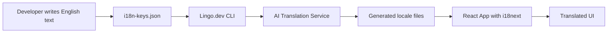
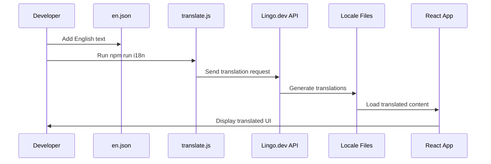

# 🌍 React Lingo Starter

Build a production-ready React localization pipeline that automates translation and integrates with `react-i18next`.

> Add text once in English, generate locale JSON automatically, and render translated UI instantly.

---

## 📋 What This App Does

React Lingo Starter is a demonstration application that showcases a complete internationalization (i18n) workflow for React applications. It provides:

- **Automated Translation Pipeline**: Generate translations for multiple languages automatically using AI-powered translation services
- **Real-time Language Switching**: Switch between languages in the browser without page reload
- **Developer-Friendly Workflow**: Write text once in English, generate all translations with a single command
- **Production-Ready Architecture**: Scalable setup ready for CI/CD integration and multi-language expansion

### 🎯 Core Functionality

The app demonstrates a modern invoice archival portal with:
- Welcome screen with translated content
- Language switching buttons (English, Hindi, French, Arabic)
- Comprehensive translation coverage for UI elements
- Error handling and user feedback in multiple languages

---

## 🏗️ How It Works

### Architecture Overview



### Key Components

#### 1. **Source of Truth** (`src/locales/en.json`)
The English translation file serves as the single source of truth for all text content. All UI strings, error messages, and labels are defined here first.

#### 2. **Translation Configuration** (`i18n.json`)
Configures the Lingo.dev translation pipeline:
- Source language: English (`en`)
- Target languages: Hindi (`hi`), French (`fr`), Arabic (`ar`)
- File patterns for translation discovery

#### 3. **React Integration** (`src/i18n.ts`)
Sets up `react-i18next` with:
- Language resources loaded from JSON files
- Default language set to English
- Fallback language handling

#### 4. **Translation Pipeline** (`scripts/translate.js`)
Node.js script that:
- Executes Lingo.dev CLI commands
- Handles API authentication via environment variables
- Processes translation requests for multiple languages

### Translation Flow

1. **Development Phase**:
   - Developer adds new text keys to `src/locales/en.json`
   - Runs `npm run i18n` to generate translations
   - Lingo.dev processes the content and creates target language files

2. **Runtime Phase**:
   - React app loads with `react-i18next` initialized
   - User clicks language buttons to switch locales
   - UI re-renders with selected language translations
   - Changes persist for the current session

---

## 🚀 Getting Started

### Prerequisites

- **Node.js** 18.0 or higher
- **npm** or **yarn** package manager
- **Lingo.dev API Key** (for translation generation)

### Installation

1. **Clone the repository**:
   ```bash
   git clone <repository-url>
   cd react-lingo-starter
   ```

2. **Install dependencies**:
   ```bash
   npm install
   ```

3. **Set up environment variables**:
   ```bash
   cp .env.example .env
   # Add your LINGO_API_KEY to .env file
   ```

4. **Generate translations** (optional - translations are pre-generated):
   ```bash
   npm run i18n
   ```

5. **Start development server**:
   ```bash
   npm run dev
   ```

The app will be available at `http://localhost:5173`

---

## 📖 Usage

### Basic Language Switching

1. Open the app in your browser
2. View the welcome message in English (default)
3. Click language buttons to switch:
   - **EN**: English
   - **HI**: Hindi (हिंदी)
   - **FR**: French (Français)
   - **AR**: Arabic (العربية)

### Development Workflow

#### Adding New Text

1. **Add English text** to `src/locales/en.json`:
   ```json
   {
     "newFeature": {
       "title": "New Feature",
       "description": "This is a new feature description"
     }
   }
   ```

2. **Generate translations**:
   ```bash
   npm run i18n
   ```

3. **Use in React components**:
   ```tsx
   import { useTranslation } from 'react-i18next';

   function MyComponent() {
     const { t } = useTranslation();

     return (
       <div>
         <h1>{t('newFeature.title')}</h1>
         <p>{t('newFeature.description')}</p>
       </div>
     );
   }
   ```

#### Testing Translations

- All translations are automatically generated when running `npm run dev`
- The build process includes translation generation
- Manual translation updates can be triggered with `npm run i18n`

---

## ⚙️ Configuration

### Translation Settings (`i18n.json`)

```json
{
  "version": "1.15",
  "locale": {
    "source": "en",
    "targets": ["hi", "fr", "ar"]
  },
  "buckets": {
    "json": {
      "include": ["src/locales/[locale].json"]
    }
  }
}
```

- **source**: Primary language for content authoring
- **targets**: Languages to generate translations for
- **buckets**: File patterns for translation processing

### Environment Variables (`.env`)

```bash
LINGO_API_KEY=your_lingo_api_key_here
```

Required for accessing Lingo.dev translation services.

### React i18next Configuration (`src/i18n.ts`)

```typescript
i18n.use(initReactI18next).init({
  resources: {
    en: { translation: en },
    hi: { translation: hi },
    fr: { translation: fr },
    ar: { translation: ar }
  },
  lng: 'en',           // Default language
  fallbackLng: 'en',   // Fallback if translation missing
  interpolation: { escapeValue: false }
});
```

---

## 🌐 Adding New Languages

### 1. Update Translation Configuration

Add new language to `i18n.json`:

```json
{
  "locale": {
    "source": "en",
    "targets": ["hi", "fr", "ar", "es", "de"]
  }
}
```

### 2. Update React Configuration

Add new language import and resource in `src/i18n.ts`:

```typescript
import es from './locales/es.json';
import de from './locales/de.json';

// Add to resources object:
es: { translation: es },
de: { translation: de }
```

### 3. Add Language Button

Update `src/App.tsx` to include new language buttons:

```tsx
<button onClick={() => i18n.changeLanguage('es')}>ES</button>
<button onClick={() => i18n.changeLanguage('de')}>DE</button>
```

### 4. Generate Translations

```bash
npm run i18n
```

---

## 🔧 Development Scripts

| Command | Description |
|---------|-------------|
| `npm run dev` | Start development server with translations |
| `npm run build` | Build for production |
| `npm run i18n` | Generate/update translations |
| `npm run docs:dev` | Start documentation server |
| `npm run docs:build` | Build documentation |
| `npm run docs:screenshots` | Capture documentation screenshots |

### Translation Pipeline Details

The `npm run i18n` script executes:
1. Extracts translatable strings from `src/locales/en.json`
2. Sends content to Lingo.dev API for translation
3. Generates/updates target language files
4. Maintains translation quality and consistency

---

## 📁 Project Structure

```
react-lingo-starter/
├── src/
│   ├── locales/           # Translation files
│   │   ├── en.json       # Source English translations
│   │   ├── hi.json       # Hindi translations
│   │   ├── fr.json       # French translations
│   │   └── ar.json       # Arabic translations
│   ├── i18n.ts           # i18next configuration
│   ├── App.tsx           # Main React component
│   └── main.tsx          # App entry point
├── scripts/
│   └── translate.js      # Translation pipeline script
├── docs/                 # Documentation site
├── i18n.json            # Lingo.dev configuration
├── package.json         # Dependencies and scripts
└── README.md            # This file
```

---

## 🔄 Translation Workflow

### Automated Pipeline



### Quality Assurance

- **Source Control**: English text maintained in version control
- **Automated Generation**: Consistent translation updates
- **Fallback Handling**: Graceful degradation if translations missing
- **Build Integration**: Translations generated during development/build

---

## 🚀 Deployment

### Production Build

```bash
npm run build
```

This creates an optimized production build with all translations included.

### CI/CD Integration

The translation pipeline can be integrated into CI/CD:

```yaml
# Example GitHub Actions workflow
- name: Generate Translations
  run: npm run i18n
  env:
    LINGO_API_KEY: ${{ secrets.LINGO_API_KEY }}

- name: Build Application
  run: npm run build
```

---

## 🤝 Contributing

1. **Add English text** to `src/locales/en.json`
2. **Test translations** with `npm run i18n`
3. **Update React components** to use new translation keys
4. **Test language switching** in the browser
5. **Submit pull request** with changes

---

## 📚 Learn More

- [react-i18next Documentation](https://react.i18next.com/)
- [Lingo.dev Platform](https://lingo.dev/)
- [i18next Ecosystem](https://www.i18next.com/)

---

## 📄 License

This project is licensed under the MIT License.
  "src/locales/en.json" --> "Translation script"
  "Translation script" --> "Lingo.dev CLI / Ollama"
  "Lingo.dev CLI / Ollama" --> "src/locales/hi.json / fr.json"
  "src/locales/hi.json / fr.json" --> "i18next"
  "i18next" --> "React UI"
```

---

## How It Works

1. Developer adds or updates UI text in `src/locales/en.json`.
2. The source key is consumed by `react-i18next` via `src/i18n.ts`.
3. The translation pipeline runs using `npx lingo run`.
4. `i18n.json` tells Lingo where locale files live and which target languages to update.
5. Translated values are written to `src/locales/hi.json` and `src/locales/fr.json`.
6. The React app renders translated strings when the active locale changes.

---

## Code Examples

### React usage

```tsx
import { useTranslation } from 'react-i18next';

function App() {
  const { t, i18n } = useTranslation();

  return (
    <div>
      <h1>{t('welcome.title')}</h1>
      <button>{t('cta.get_started')}</button>
      <button onClick={() => i18n.changeLanguage('hi')}>HI</button>
      <button onClick={() => i18n.changeLanguage('fr')}>FR</button>
    </div>
  );
}
```

### Source JSON example

```json
{
  "welcome.title": "Welcome to your app",
  "cta.get_started": "Get Started",
  "header.dashboard": "Dashboard"
}
```

### Translation script example

```js
import { execSync } from 'child_process';
import dotenv from 'dotenv';

dotenv.config();

const output = execSync(
  `npx lingo translate --input i18n-keys.json --locales hi,fr --api-key ${process.env.LINGO_API_KEY}`,
  { encoding: 'utf-8' }
);
console.log(output);
```

### package.json scripts

```json
{
  "scripts": {
    "dev": "npm run i18n && vite",
    "build": "vite build",
    "i18n": "npx lingo run"
  }
}
```

---

## Project Structure

```text
.
├── README.md
├── package.json
├── package-lock.json
├── i18n.json
├── i18n-keys.json
├── i18n.lock
├── .env
├── scripts/
│   ├── extract.js
│   ├── translate.js
│   └── verify.js
├── src/
│   ├── main.tsx
│   ├── i18n.ts
│   ├── App.tsx
│   ├── App.css
│   ├── index.css
│   └── locales/
│       ├── en.json
│       ├── fr.json
│       └── hi.json
├── public/
│   ├── favicon.svg
│   └── icons.svg
└── index.html
```

---

## Setup Instructions

1. Install node dependencies:

```bash
npm install
```

2. Install or make sure the Lingo CLI is available:

```bash
npm install -g @lingo.dev/cli
```

3. Create a `.env` file with your API key:

```env
LINGO_API_KEY="your_lingo_api_key"
```

4. Generate or refresh locale files:

```bash
npm run i18n
```

5. Start the development server:

```bash
npm run dev
```

6. Open the app in your browser at the URL shown by Vite.

---

## Developer Workflow

- Add or update keys in `src/locales/en.json`.
- Use `t('your.key')` in React components.
- Run `npm run i18n` to build translated locale files.
- Confirm `src/locales/hi.json` and `src/locales/fr.json` contain translated values.
- Start the app with `npm run dev` and switch languages.

For translations key extraction, use:

```bash
node scripts/extract.js
```

To verify missing keys in Hindi translations:

```bash
node scripts/verify.js
```

---

## Advantages

- **Faster localization** than spreadsheets or manual copy/paste
- **Centralized source of truth** in `src/locales/en.json`
- **Automatic locale generation** for multiple languages
- **Low infrastructure overhead** compared to SaaS-only workflows
- **Built-in change detection** via `i18n.lock`

---

## Limitations

- Translation quality depends on the configured provider and prompt context
- The current example is best suited for short UI strings, not large documents
- Some contextual meaning can be lost if keys are too generic
- Performance depends on how often translations are regenerated and cached

---

## Scaling to Production

- **Translation caching:** `i18n.lock` tracks fingerprints and avoids reprocessing unchanged strings
- **Batch translation:** `lingo.dev` can process multiple target locales in one run
- **CI/CD integration:** run `npm run i18n` as part of build or deployment pipelines
- **Multi-language expansion:** add new locale codes to `i18n.json` and add matching JSON files
- **Enterprise / multi-tenant usage:** separate locale buckets, provider settings, and glossary rules can be added on top of this architecture

---

## Future Enhancements

- Add a **real-time translation API** or local translation server
- Add **vector memory** for translation reuse and fuzzy lookup
- Build an **admin dashboard** for copy editing, glossary management, and review
- Add support for **pluralization**, **namespaces**, and **nested locale files**
- Add **build-time i18n compilation** for zero-runtime overhead

---

## Notes

- This repo currently uses `lingo.dev` as the translation orchestration layer.
- If you want to substitute a different local LLM provider, update `scripts/translate.js` or adjust the `lingo` command to use your preferred backend.
- Keep `.env` out of version control and never commit API keys.
