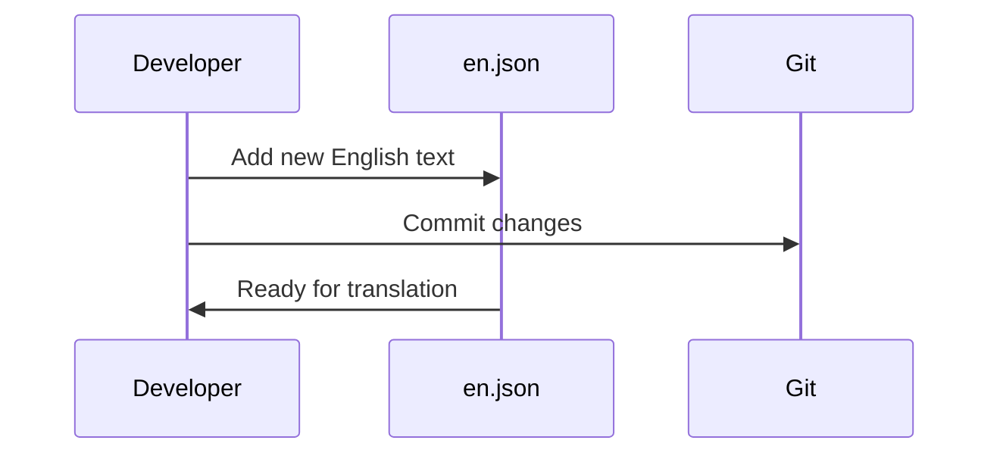
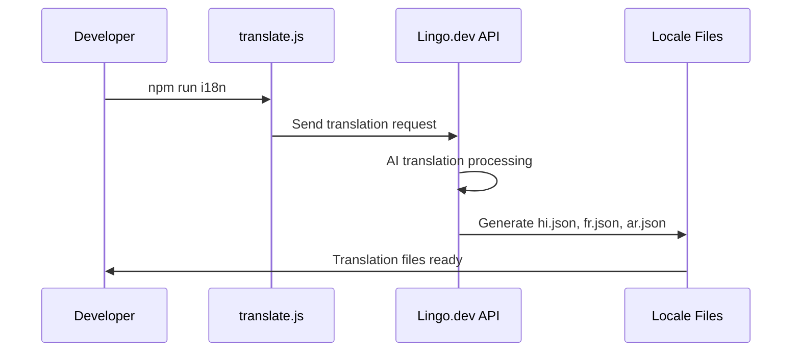
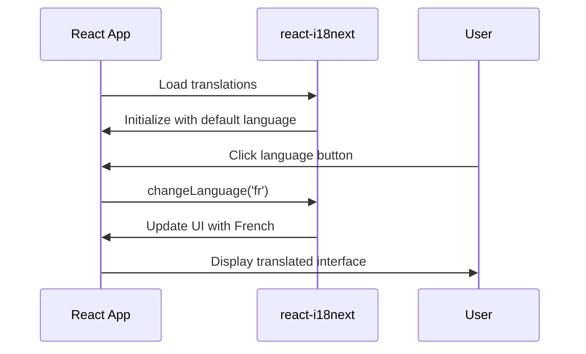

# 🏗️ How It Works

Understand the complete architecture and workflow of React Lingo Starter's automated internationalization system.

## Architecture Overview

React Lingo Starter implements a modern, scalable internationalization workflow that eliminates manual translation processes.

```mermaid
flowchart LR
    subgraph "Development Phase"
        A[Developer] --> B[Write English Text]
        B --> C[src/locales/en.json]
        C --> D[npm run i18n]
    end

    subgraph "Translation Pipeline"
        D --> E[Lingo.dev CLI]
        E --> F[AI Translation Service]
        F --> G[Generate Locales]
    end

    subgraph "Runtime Phase"
        G --> H[React App]
        H --> I[react-i18next]
        I --> J[Translated UI]
    end

    J --> K[User Interaction]
    K --> L[Language Switching]
```



## Core Components

### 1. Source of Truth (`src/locales/en.json`)

The English translation file serves as the single source of truth for all application text:

```json
{
  "welcome": {
    "title": "Welcome to React Lingo Starter",
    "subtitle": "AI-powered localization made simple"
  },
  "navigation": {
    "home": "Home",
    "about": "About",
    "contact": "Contact"
  }
}
```

**Key Principles:**
- All text is authored in English first
- Nested structure supports complex UI hierarchies
- Serves as the master reference for all translations

### 2. Translation Configuration (`i18n.json`)

Configures the Lingo.dev translation pipeline:

```json
{
  "version": "1.15",
  "locale": {
    "source": "en",
    "targets": ["hi", "fr", "ar"]
  },
  "buckets": {
    "json": {
      "include": ["src/locales/[locale].json"]
    }
  }
}
```

**Configuration Options:**
- **source**: Primary authoring language
- **targets**: Languages to generate automatically
- **buckets**: File patterns for translation processing

### 3. React Integration (`src/i18n.ts`)

Sets up `react-i18next` for seamless React integration:

```typescript
import i18n from 'i18next';
import { initReactI18next } from 'react-i18next';

import en from './locales/en.json';
import hi from './locales/hi.json';
import fr from './locales/fr.json';
import ar from './locales/ar.json';

i18n
  .use(initReactI18next)
  .init({
    resources: {
      en: { translation: en },
      hi: { translation: hi },
      fr: { translation: fr },
      ar: { translation: ar }
    },
    lng: 'en',
    fallbackLng: 'en',
    interpolation: { escapeValue: false }
  });
```

### 4. Translation Pipeline (`scripts/translate.js`)

Node.js script that orchestrates the translation process:

```javascript
import { execSync } from 'child_process';
import dotenv from 'dotenv';

dotenv.config();

try {
  const output = execSync(
    `npx lingo translate --input i18n-keys.json --locales hi,fr,ar --api-key ${process.env.LINGO_API_KEY}`,
    { encoding: 'utf-8' }
  );
  console.log('✅ Translation completed:', output);
} catch (error) {
  console.error('❌ Translation failed:', error.message);
}
```

## Translation Workflow

### Phase 1: Content Authoring



### Phase 2: Translation Generation



### Phase 3: Runtime Integration



## Key Technologies

### React i18next

**Purpose**: Runtime internationalization for React applications

**Features Used**:
- `useTranslation()` hook for component integration
- `i18n.changeLanguage()` for dynamic switching
- Resource loading and fallback handling
- Interpolation and pluralization support

**Integration Example**:
```tsx
import { useTranslation } from 'react-i18next';

function WelcomeComponent() {
  const { t, i18n } = useTranslation();

  return (
    <div>
      <h1>{t('welcome.title')}</h1>
      <button onClick={() => i18n.changeLanguage('fr')}>
        {t('buttons.switchToFrench')}
      </button>
    </div>
  );
}
```

### Lingo.dev CLI

**Purpose**: Automated translation generation and management

**Key Features**:
- AI-powered translation using machine learning
- Context-aware translations
- Batch processing for multiple languages
- API integration for CI/CD pipelines

**Command Structure**:
```bash
npx lingo translate \
  --input i18n.json \
  --locales hi,fr,ar \
  --api-key $LINGO_API_KEY
```

## File Processing Flow

### Input Processing

1. **Parse Configuration**: Read `i18n.json` for source/target languages
2. **Extract Keys**: Scan `src/locales/en.json` for translatable strings
3. **Context Analysis**: Analyze key names and surrounding context
4. **Batch Preparation**: Group keys for efficient API processing

### Translation Generation

1. **API Request**: Send batches to Lingo.dev translation service
2. **AI Processing**: Apply machine learning translation models
3. **Quality Assurance**: Validate translation quality and consistency
4. **Locale File Creation**: Generate target language JSON files

### Output Validation

1. **Structure Verification**: Ensure all keys are translated
2. **Fallback Handling**: Verify fallback mechanisms work
3. **Integration Testing**: Confirm React app loads translations correctly

## Error Handling & Fallbacks

### Translation Failures

- **Network Issues**: Retry logic with exponential backoff
- **API Limits**: Queue management and rate limiting
- **Invalid Keys**: Validation and error reporting

### Runtime Fallbacks

- **Missing Translations**: Automatic fallback to English
- **Loading States**: Graceful handling during translation loading
- **Error Boundaries**: Component-level error isolation

## Performance Considerations

### Bundle Optimization

- **Code Splitting**: Lazy load translation resources
- **Compression**: Gzip compression for JSON files
- **Caching**: Browser caching for translation assets

### Runtime Performance

- **Memory Management**: Efficient resource loading
- **Change Detection**: Optimized re-rendering on language switch
- **Bundle Size**: Minimal impact on application size

## Security & Privacy

### API Key Management

- **Environment Variables**: Secure key storage
- **Access Control**: Restricted API permissions
- **Audit Logging**: Translation request monitoring

### Data Protection

- **Content Privacy**: Secure transmission of source text
- **Translation Storage**: Encrypted translation pipelines
- **Compliance**: GDPR and privacy regulation adherence

## Integration Patterns

### Development Workflow

```bash
# 1. Add English text
echo '{"newFeature": "New feature added"}' >> src/locales/en.json

# 2. Generate translations
npm run i18n

# 3. Test in browser
npm run dev
```

### CI/CD Integration

```yaml
# .github/workflows/translate.yml
name: Generate Translations
on: [push, pull_request]

jobs:
  translate:
    runs-on: ubuntu-latest
    steps:
      - uses: actions/checkout@v3
      - uses: actions/setup-node@v3
        with:
          node-version: '18'
      - name: Install dependencies
        run: npm ci
      - name: Generate translations
        run: npm run i18n
        env:
          LINGO_API_KEY: ${{ secrets.LINGO_API_KEY }}
```

## Monitoring & Analytics

### Translation Metrics

- **Coverage Tracking**: Percentage of translated content
- **Quality Scores**: Translation accuracy measurements
- **Performance Monitoring**: Translation generation speed

### Usage Analytics

- **Language Preferences**: Most used languages tracking
- **Fallback Frequency**: Missing translation detection
- **User Behavior**: Language switching patterns

## Advanced Configuration

### Custom Translation Rules

```json
{
  "buckets": {
    "json": {
      "include": ["src/locales/[locale].json"],
      "exclude": ["**/test/**"],
      "options": {
        "preserveFormatting": true,
        "contextAware": true
      }
    }
  }
}
```

### Multiple Environments

```json
{
  "environments": {
    "development": {
      "targets": ["hi", "fr"]
    },
    "production": {
      "targets": ["hi", "fr", "ar", "es", "de"]
    }
  }
}
```

## Troubleshooting

### Common Issues

**Translations not generating:**
- Check `LINGO_API_KEY` environment variable
- Verify `i18n.json` configuration
- Ensure network connectivity to Lingo.dev

**Runtime translation errors:**
- Confirm locale files exist and are valid JSON
- Check React component import paths
- Verify `i18n.ts` configuration

**Performance issues:**
- Implement lazy loading for large translation files
- Use CDN for translation asset delivery
- Optimize bundle splitting

## Next Steps

- [Getting Started](./getting-started) - Set up your development environment
- [Language Switching](./language-switching) - See translations in action
- [Contributing Guide](./contributing) - Help improve the project