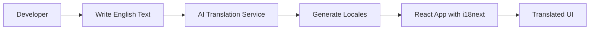

# 🌍 Welcome to React Lingo Starter

**Build production-ready React localization pipelines that automate translation and integrate seamlessly with `react-i18next`.**

> Add text once in English, generate locale JSON automatically, and render translated UI instantly.

## 🚀 What You'll Learn

This documentation will guide you through:

- **Setting up** a complete internationalization workflow
- **Understanding** the automated translation pipeline
- **Implementing** real-time language switching
- **Scaling** your localization for production apps
- **Integrating** with modern CI/CD pipelines

## 🎯 Quick Start

Ready to get started? Jump right in:

- **[Getting Started](./getting-started)** - Set up your development environment
- **[How It Works](./how-it-works)** - Understand the architecture
- **[Language Switching](./language-switching)** - See translations in action

## 📋 What This Project Does

React Lingo Starter demonstrates a modern approach to React internationalization:

### ✨ Key Features

- **🤖 Automated Translation Pipeline** - Generate translations for multiple languages automatically using AI
- **⚡ Real-time Language Switching** - Switch between languages in the browser without page reload
- **👨‍💻 Developer-Friendly Workflow** - Write text once in English, generate all translations with a single command
- **🏭 Production-Ready Architecture** - Scalable setup ready for CI/CD integration and multi-language expansion

### 🎨 Live Demo

The app showcases a modern interface with:
- Welcome screen with translated content
- Language switching buttons (English, Hindi, French, Arabic)
- Comprehensive translation coverage for UI elements
- Error handling and user feedback in multiple languages

## 🏗️ Architecture at a Glance



**The Flow:**
1. **Author** content in English JSON files
2. **Generate** translations automatically via AI
3. **Integrate** with React using `react-i18next`
4. **Deploy** with full internationalization support

## 🎯 Who This Is For

- **React Developers** wanting to add internationalization
- **Development Teams** needing scalable localization workflows
- **Product Managers** requiring multi-language support
- **DevOps Engineers** implementing CI/CD localization pipelines

## 📚 Documentation Structure

### 📖 Core Documentation
- **[Getting Started](./getting-started)** - Installation and setup
- **[How It Works](./how-it-works)** - Architecture and workflow
- **[Language Switching](./language-switching)** - Translation system demo

### 🛠️ Advanced Topics
- Configuration options
- CI/CD integration
- Performance optimization
- Troubleshooting guides

## 🤝 Contributing

We welcome contributions! See our [Contributing Guide](./contributing) for details on:
- Reporting bugs
- Suggesting features
- Submitting code changes
- Improving documentation

## 📞 Support

- 📧 **Issues**: [GitHub Issues](https://github.com/your-org/react-lingo-starter/issues)
- 💬 **Discussions**: [GitHub Discussions](https://github.com/your-org/react-lingo-starter/discussions)
- 📖 **Documentation**: You're reading it! 🎉

---

**Ready to internationalize your React app?** Let's get started with [Getting Started](./getting-started)! 🚀

Generate a new Docusaurus site using the **classic template**.

The classic template will automatically be added to your project after you run the command:

```bash
npm init docusaurus@latest my-website classic
```

You can type this command into Command Prompt, Powershell, Terminal, or any other integrated terminal of your code editor.

The command also installs all necessary dependencies you need to run Docusaurus.

## Start your site

Run the development server:

```bash
cd my-website
npm run start
```

The `cd` command changes the directory you're working with. In order to work with your newly created Docusaurus site, you'll need to navigate the terminal there.

The `npm run start` command builds your website locally and serves it through a development server, ready for you to view at http://localhost:3000/.

Open `docs/intro.md` (this page) and edit some lines: the site **reloads automatically** and displays your changes.
